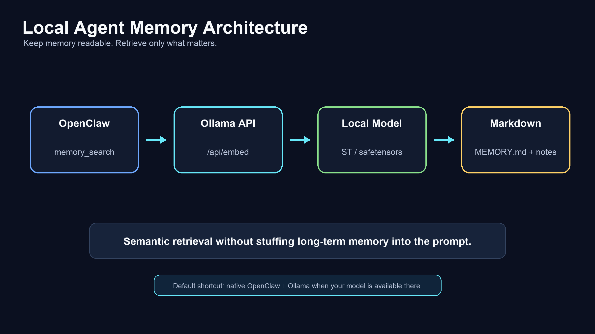
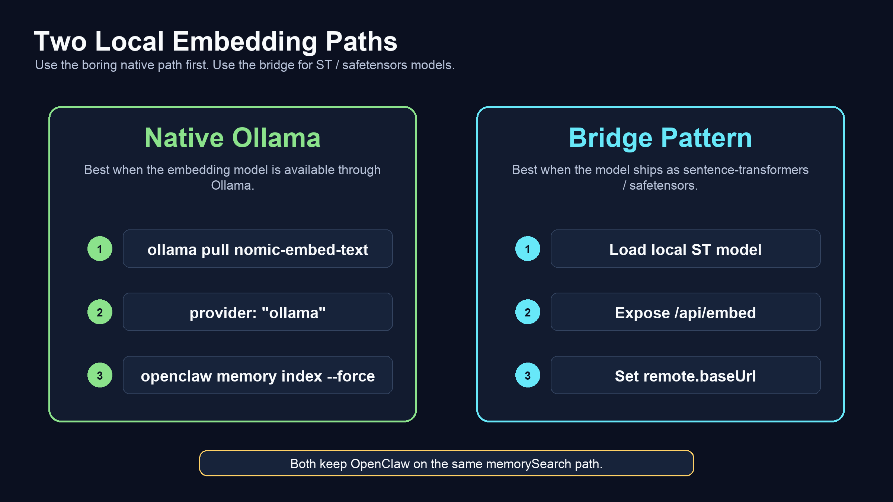
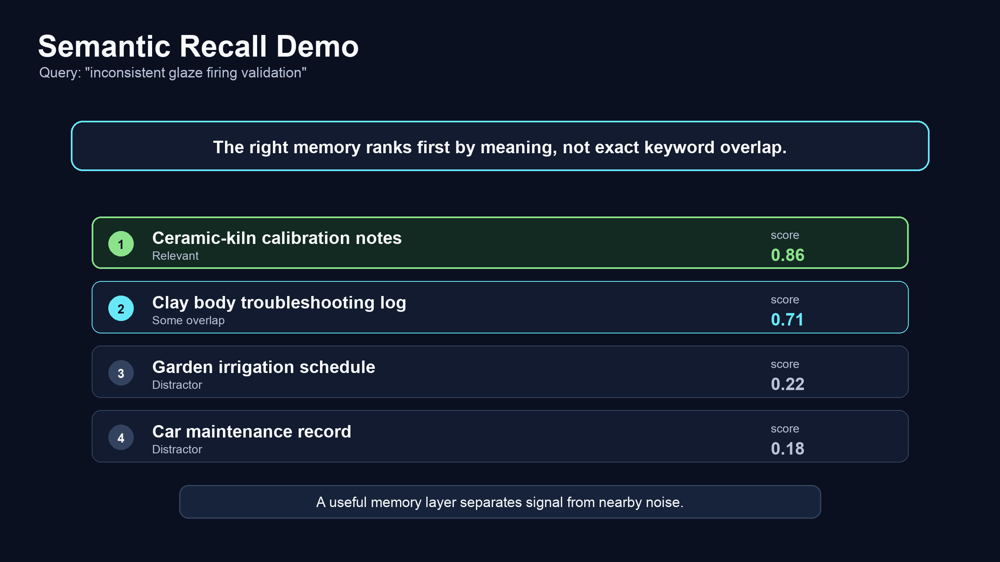

# Local Agent Memory with OpenClaw, Ollama, and Sentence Transformers

Agent memory does not scale by stuffing everything into the prompt or one giant `MEMORY.md` file.

That works when the agent has a small amount of context. It breaks down once the agent starts accumulating durable history: decisions, preferences, workflows, project notes, troubleshooting details, and all the other context that makes an agent useful over time.

At that point, memory usually fails in one of two ways.

The first failure mode is context bloat. You carry too much history forward, every turn gets heavier, and the prompt starts doing work that a retrieval layer should be doing.

The second failure mode is over-compression. You summarize aggressively enough to keep context small, but the memory turns into something you cannot easily inspect, edit, debug, or trust.

I wanted a cleaner middle path for OpenClaw agent memory: keep memory in plain markdown, use semantic search to pull in the relevant pieces, and keep the embedding layer local.

This post explains the pattern, the native OpenClaw shortcut, and the small sentence-transformers bridge I built for models that are distributed as safetensors instead of normal Ollama pulls.

Repo: <https://github.com/promptclickrun/harrier-openclaw-memory-search>



## The short version

OpenClaw already supports Ollama as a native `memorySearch` embedding provider. If you just want local embeddings, start there.

The common path looks like this:

```bash
ollama pull nomic-embed-text
openclaw memory index --force
```

Then configure OpenClaw memory search with Ollama:

```jsonc
{
  "agents": {
    "defaults": {
      "memorySearch": {
        "provider": "ollama",
        "model": "nomic-embed-text"
      }
    }
  }
}
```

For many setups, that is the right answer. It is supported, simple, and fast.

The repo in this post covers a narrower and still useful case: using local sentence-transformers / safetensors embedding models through the same Ollama-compatible API surface that OpenClaw already expects.

Harrier is the included example model, but the reusable part is the bridge pattern.

## Why agent memory needs retrieval

Durable agent memory should be easy for humans to inspect.

That is why markdown is a good memory format. You can read it, diff it, version it, edit it, and delete bad entries without learning a new database tool. The problem is retrieval. Once memory grows past a few pages, the agent needs a way to find relevant context without loading all of it into the prompt.

Keyword search helps, but it misses concepts when the wording changes. A note about kiln calibration might be relevant to a later query about inconsistent glaze firing, even if the exact phrase never appears in the note.

That is where embeddings help. They turn text into vectors so related ideas can rank near each other by meaning, not just by exact word overlap.

The important part is to keep that layer boring:

1. Store durable memory in markdown.
2. Chunk and embed the markdown.
3. At query time, embed the question.
4. Rank relevant chunks.
5. Load only the useful memory into the agent turn.

The agent gets targeted recall. The human still gets plain files.

## The native OpenClaw path: use Ollama first

The first question people asked was the right one: why not just use OpenClaw's native Ollama support?

If your goal is simply local embeddings, you should.

OpenClaw can use Ollama directly for memory search embeddings. The default local model in the OpenClaw Ollama docs is `nomic-embed-text`, and a minimal setup can be done in a few commands.

For a local Ollama instance:

```jsonc
{
  "agents": {
    "defaults": {
      "memorySearch": {
        "provider": "ollama",
        "model": "nomic-embed-text"
      }
    }
  }
}
```

For an Ollama host on another machine, set `remote.baseUrl`:

```jsonc
{
  "agents": {
    "defaults": {
      "memorySearch": {
        "provider": "ollama",
        "model": "nomic-embed-text",
        "remote": {
          "baseUrl": "http://gpu-box.local:11434",
          "apiKey": "ollama-local"
        }
      }
    }
  }
}
```

OpenClaw also supports custom provider IDs that use `api: "ollama"`, which is useful if you want to route memory embeddings to a dedicated Ollama host:

```jsonc
{
  "models": {
    "providers": {
      "ollama-memory": {
        "api": "ollama",
        "baseUrl": "http://gpu-box.local:11434",
        "apiKey": "ollama-local",
        "models": [{ "id": "nomic-embed-text" }]
      }
    }
  },
  "agents": {
    "defaults": {
      "memorySearch": {
        "provider": "ollama-memory",
        "model": "nomic-embed-text"
      }
    }
  }
}
```

That native path should be the default recommendation.



## Where the sentence-transformers bridge fits

Some embedding models are distributed as sentence-transformers / safetensors packages rather than normal Ollama models.

That matters because OpenClaw already has a clean memory-search integration point: an Ollama-compatible embedding endpoint. If a local model can be exposed through that API shape, OpenClaw does not need a new memory provider, a new tool, or a special retrieval path.

That is the point of this repo.

It provides a small Python server that loads a local sentence-transformers model and exposes the endpoints OpenClaw already knows how to call:

| Endpoint | Purpose |
| --- | --- |
| `POST /api/embed` | Batch embeddings in Ollama's embedding response shape |
| `POST /api/embeddings` | Single embedding compatibility endpoint |
| `GET /health` | Readiness, device, uptime, and model status |
| `GET /api/tags` | Ollama-style model discovery |
| `GET /api/version` | Version string |

The server is about 200 lines. The rest of the repo is the operational wiring around it: OpenClaw config, launchd, smoke tests, and a demo corpus.

## Harrier as the example model

The bundled model is Microsoft's `microsoft/harrier-oss-v1-0.6b`.

Harrier is Microsoft's open multilingual embedding family. Microsoft describes it as using a decoder-only architecture with last-token pooling and L2 normalization, and says Harrier ranked 1st on multilingual MTEB-v2 as of April 6, 2026.

For this repo, the key point is format and deployment. The Harrier example is loaded through the sentence-transformers / safetensors path, then exposed through an Ollama-compatible local API.

That gives you this shape:

```text
OpenClaw memory_search
        |
        v
Ollama-compatible embedding API
        |
        v
sentence-transformers / safetensors model
        |
        v
plain markdown memory files
```

The model can run locally on CPU or Apple Silicon. In the reference server, embeddings are normalized server-side, which keeps cosine-style ranking straightforward in the demo scripts.

## What the repo includes

The repo contains the pieces needed to make the pattern usable rather than just theoretical:

- A small Python embedding server with an Ollama-compatible API surface.
- OpenClaw `memorySearch` config examples.
- A minimal config and a full hybrid setup with vector search, lexical scoring, MMR, and temporal decay.
- A macOS `launchd` template to keep the server running.
- Smoke tests to confirm the endpoint is healthy before trusting recall.
- A mock markdown memory corpus for local testing.
- Demo scripts that build an index and query it without needing a live OpenClaw session.

The repo is not trying to introduce a new retrieval algorithm. Embeddings and cosine similarity have been around for years. Sentence-transformers has been doing this work for a long time.

The useful artifact is the integration pattern: a local sentence-transformers model, an Ollama-compatible API, OpenClaw memory search config, plain markdown memory, and enough validation to know the layer works.

## Quick start

Clone the repo and install dependencies:

```bash
git clone https://github.com/promptclickrun/harrier-openclaw-memory-search.git
cd harrier-openclaw-memory-search

python3 -m venv .venv
source .venv/bin/activate
pip install -r requirements.txt
```

Start the embedding server:

```bash
scripts/run_server.sh
```

Run the smoke test:

```bash
scripts/smoke_test.sh
```

Expected result:

```text
PASS: server healthy, 1024-d embeddings, batch shape correct
```

Build the demo index:

```bash
python3 scripts/build_index.py
```

Query the mock corpus:

```bash
python3 scripts/query_index.py --query "inconsistent glaze firing validation job"
```

The expected behavior is that the ceramic-kiln calibration notes rank above unrelated garden and car entries. That is the whole value in one example: concept recall without needing exact keyword overlap.



## Wiring the shim into OpenClaw

For OpenClaw, point `memorySearch` at the local embedding server:

```jsonc
{
  "agents": {
    "defaults": {
      "memorySearch": {
        "enabled": true,
        "provider": "ollama",
        "model": "harrier",
        "remote": {
          "baseUrl": "http://127.0.0.1:18840"
        },
        "cache": {
          "enabled": true
        }
      }
    }
  }
}
```

Then rebuild the memory index:

```bash
openclaw memory index --force
```

After that, OpenClaw's `memory_search` tool can use the local embedding endpoint for semantic recall.

The full example config adds hybrid retrieval options:

- Vector similarity for semantic recall.
- Lexical scoring for exact-match anchors.
- MMR for result diversity.
- Temporal decay so newer memory can rank higher when appropriate.

Those pieces are optional, but they make memory search feel more useful in real agent workflows.

## What this is good for

This pattern is useful when you want:

- Local embeddings without sending memory text to a hosted API.
- Plain markdown memory that remains readable and versionable.
- A sentence-transformers / safetensors model that is not available as a normal Ollama pull.
- An Ollama-compatible API surface so OpenClaw does not need custom retrieval code.
- A small service you can inspect, modify, and run under launchd.
- A smoke-testable memory layer before you trust the agent's recall.

It is also useful as a reference pattern. Swap the model loading code, keep the API shape, and you can adapt the same pattern to other local embedding models.

## Tradeoffs

Use native Ollama first when the model you want is available there. It is the fastest supported path and the least custom operational surface.

Use this bridge when the model you want lives in the sentence-transformers / safetensors ecosystem, or when you want a minimal, inspectable shim around a specific local embedding model.

The tradeoff is simple: you own one small service. In return, you get direct control over the model loading path, endpoint behavior, validation, and deployment wrapper.

For agent memory, that can be a reasonable trade.

## The part that matters

The deeper point is not Harrier specifically. It is that agent memory should be both machine-searchable and human-maintainable.

Plain markdown gives you the human side. Embeddings give you semantic retrieval. OpenClaw's `memorySearch` config gives you the integration point. An Ollama-compatible shim gives you a clean way to use local sentence-transformers models without changing the rest of the agent stack.

That is the middle path I wanted: durable memory that stays local, stays inspectable, and does not have to live inside one giant prompt.

Repo: <https://github.com/promptclickrun/harrier-openclaw-memory-search>
